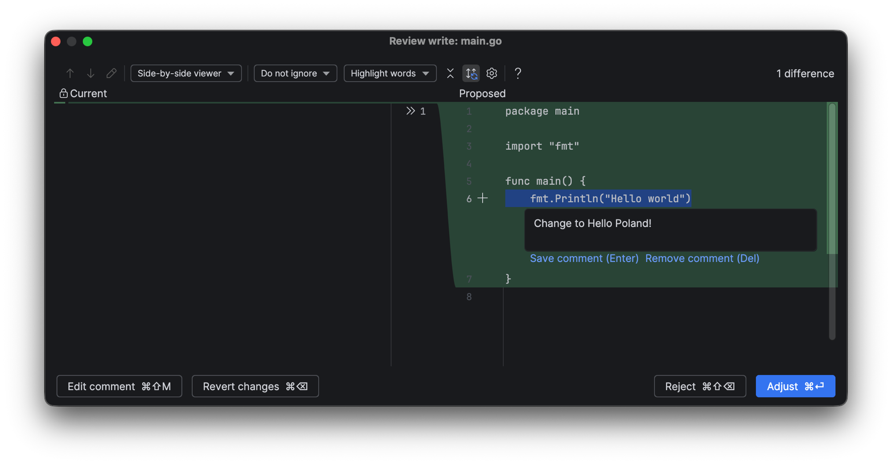
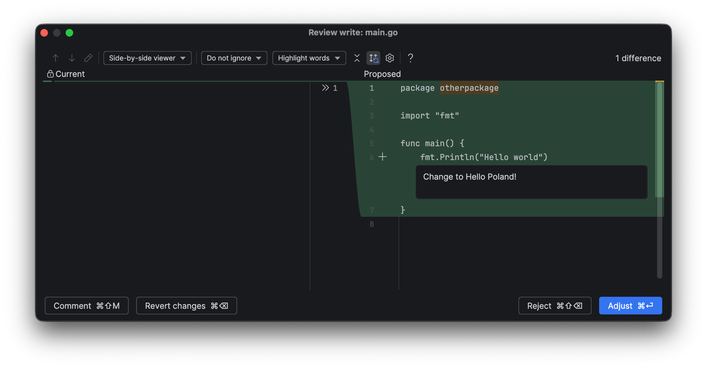
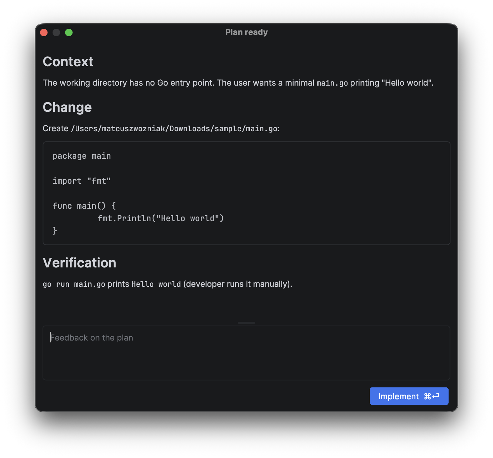
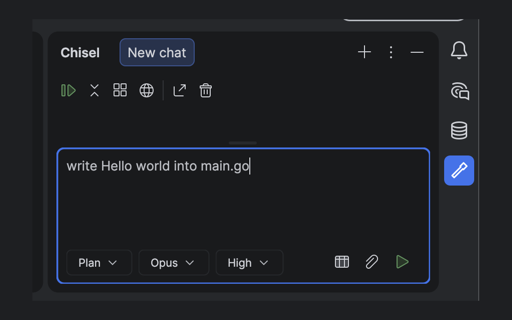

# Chisel

An IntelliJ IDEA tool window that runs the Claude Code CLI installed on your machine and stops
every file write in a review dialog, where the proposal can be commented line by line and edited
by hand before it reaches disk.

## Reviewing a write

Write, Edit and NotebookEdit open the IDE's own side-by-side diff. The left side holds the file
as it is on disk and is read-only; the right side holds the agent's proposal in an editable
document.



Every line in the proposal takes a comment. The `+` control in the gutter opens an inline field,
`⌘⇧M` opens one at the caret, `Enter` saves it and `Del` removes it. Comments stay pinned to
their line and stack up across the file.



The proposal is also a normal editor: typing in it rewrites the agent's text, and every character
that differs from what the agent proposed is highlighted. **Revert changes** (`⌘⌫`) drops the
comments and the edits and brings back the untouched proposal.

Three ways out of the dialog:

| Button | What the agent receives |
| --- | --- |
| **Accept** (`⌘⏎`, when nothing was touched) | `{"behavior":"allow"}` — the write goes through unchanged |
| **Adjust** (`⌘⏎`, after a comment or an edit) | `{"behavior":"deny"}` with the edited file in a fenced block and the comments as a `line N: text` list |
| **Reject** (`⌘⇧⌫`) | `{"behavior":"deny","interrupt":true}` — the turn ends |

The denial that carries feedback tells the agent that the comments outrank the edited file
wherever the two disagree, and that the decisions apply to every file it touches afterwards. A
denied write is not applied, and the review stays in the conversation history.

## Modes

| Mode | Behaviour |
| --- | --- |
| Ask | Every tool that asks for permission is denied with a note that the conversation is read-only. Reading, searching and web tools work as usual. |
| Plan | `--permission-mode plan`. Write, Edit and NotebookEdit are denied without a dialog. |
| Implementation | `--permission-mode manual`. Write, Edit and NotebookEdit open the review dialog. Bash and the rest open an allow/deny dialog. |
| Auto | `--permission-mode auto`. The CLI decides; the dialogs still appear for anything it escalates. |

Read, Glob, Grep, WebFetch, WebSearch, TodoWrite and Task run without asking in every mode.
Switching modes sends `set_permission_mode` on the control channel, so the process keeps running.



When the agent calls `ExitPlanMode`, the plan opens in its own dialog with a feedback field. With
the field empty the button reads **Implement** (`⌘⏎`) and approves the call, which flips the mode;
with notes in it the button reads **Send feedback**, the call is denied and the notes go back as
the next instruction.

Shell commands open a dialog with the command and the agent's description of it. In
Implementation mode the system prompt is extended with a request for commands that read clearly:
one thing per call, no unrelated work chained with `&&`, long option names, a description on
every call. Questions from `AskUserQuestion` open as a dialog with the options as buttons.

## Rewind

Clicking a message you sent opens a confirmation showing which files will be restored and how
many messages will be dropped. Confirming sends `rewind_files` with that message's UUID, then
restarts the process with `--resume <id> --resume-session-at <uuid>` and puts the original
prompt back in the input field.

Checkpoints cover Write, Edit and NotebookEdit. Changes made through Bash and edits applied by
subagents are not restored.

## Conversations



The Conversations tool window on the left lists every conversation, with a search field, and a
right click offers Rename and Delete; deleting also offers to remove the underlying Claude CLI
session file. Selecting an entry shows it in the Chisel tool window on the right, one
conversation at a time. The `+` button in the Chisel header starts a new one.

Sessions started in the terminal from the same project directory are read in the background and
join the list with their transcripts. A conversation carries streamed text, collapsible thinking
blocks, tool calls with their arguments and results, nested subagent messages, and the plan list
rebuilt live from `TodoWrite`.

The conversation toolbar holds Continue, Compact, Subagents, Remote control, Export and Delete.
Export writes the transcript as Markdown. Next to the prompt input sit the context meter, the
token counts and the session cost.

Model and effort are set per conversation from the bar under the prompt. Settings | Tools |
Chisel holds the default mode and a model and effort pair for Plan and for Implementation; Ask
and Auto start from the Plan pair. Effort ranges from Low to Max, plus Ultracode, which passes
`--settings {"ultracode":true}`.

## Attachments

Files and images attach to a prompt through the paperclip button, drag and drop, or a paste from
the clipboard. Images travel as base64 content blocks; other files travel as a path the agent
reads. Screenshots pasted into the input are written to the IDE system directory, which the CLI
receives as `--add-dir`.

In IDEs with the Database plugin, a second button lists the schemas of every configured data
source. The chosen schemas are rendered as `CREATE TABLE` text — columns with types, defaults and
comments, primary and foreign keys with their referential actions, indexes, and views as their
column list — written to a `.sql` file and attached like any other file. A data source that has
not been introspected yet is introspected on selection. In IDEs without the Database plugin the
button is absent.

## Remote control

The Remote control toggle asks the CLI for a session URL and shows it in a dialog with a copy
button. Opening that URL on another device drives the same conversation; the toolbar shows
whether the bridge is connected.

## Authentication

The plugin starts the unmodified `claude` binary as a subprocess and speaks its stream-json
protocol. Sign-in happens through Claude Code's own flow:

```
claude auth login
```

Chisel is not affiliated with Anthropic.

## Requirements

- IntelliJ IDEA 2025.3 or newer, on any platform variant
- JDK 21 for building
- Claude Code CLI on `PATH`, or at `~/.local/bin/claude`, `~/.claude/local/claude` or
  `~/.bun/bin/claude`

## Building

```
./gradlew buildPlugin     # artifact in build/distributions
./gradlew verifyPlugin    # JetBrains Plugin Verifier on the recommended IDEs
./gradlew runIde          # sandbox IDE with the plugin loaded
```

The build compiles against IntelliJ IDEA Ultimate 2025.3, which bundles the Database plugin, and
leaves `untilBuild` open. `Jenkinsfile` runs the build, the verifier and, behind a parameter,
`publishPlugin`.

## Process invocation

```
claude --print --verbose \
  --input-format stream-json --output-format stream-json \
  --include-partial-messages --replay-user-messages --forward-subagent-text \
  --permission-prompt-tool stdio \
  --add-dir <IDE system directory>/chisel \
  --permission-mode plan|manual|auto \
  --allowedTools "Read,Glob,Grep,WebFetch,WebSearch,TodoWrite,Task" \
  --model best|opus|sonnet|haiku|fable \
  --effort low|medium|high|xhigh|max \
  --session-id <uuid>
```

with `CLAUDE_CODE_ENABLE_SDK_FILE_CHECKPOINTING=true` in the environment.

`--permission-prompt-tool stdio` routes permission questions to the host over the control channel
as `can_use_tool` requests. `--permission-prompt-tool`, `--resume-session-at` and `--rewind-files`
do not appear in `claude --help`.

## State on disk

Conversation metadata is stored in `.idea/workspace.xml` under `ChiselConversations`. Transcripts
are written as JSONL under the IDE system directory, one file per conversation. Pasted images and
generated schema files live under `<IDE system directory>/chisel`. Reopening the IDE restores the
conversation list and the conversation that was selected last; the `claude` process starts when
you send the first message in it. Deleting a conversation removes its JSONL file.
